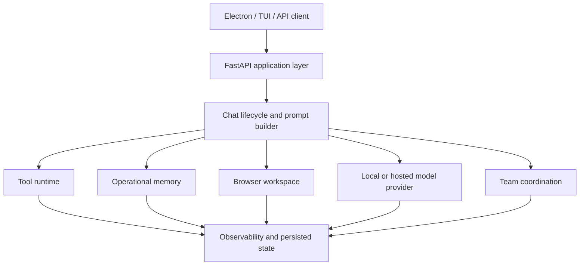

# PersonAgent — reviewer guide

> **30-second summary:** PersonAgent is an alpha local-workspace agent platform that combines model providers, tool execution, browser automation, operational memory, team coordination and desktop/terminal clients behind a FastAPI application layer.

## What makes it relevant

PersonAgent is the broadest agent-engineering repository in this portfolio. It is not a finished assistant; it is a large experimental system where practical agent concerns are implemented together: evidence gathering, tool budgets, provider boundaries, long-running state, browser workspaces, memory recall, multi-agent coordination and desktop interaction.

The honest evaluation is therefore **high technical breadth, meaningful implementation depth, and incomplete consolidation**.

## Review map

| Capability | Evidence to inspect | Why it matters |
|---|---|---|
| Chat execution lifecycle | `@backend/src/personagent/application/use_cases/chat/` | Separates investigation, lifecycle, messaging, prompting, streaming and tooling concerns |
| Evidence sufficiency | `@backend/src/personagent/application/use_cases/chat/evidence_gate.py` | Uses objective tool/search/file coverage before allowing a codebase answer |
| Operational memory | `@backend/src/personagent/domain/memory/` | Implements redaction, chunking, structured memory and recall budgets |
| Provider request boundary | `@backend/src/personagent/application/security.py` | Screens the initial request and prompt-package fields before hosted inference; it does not prove that tool-derived content is re-scanned before every later inference pass |
| Prompt architecture | `@backend/src/personagent/domain/prompts/` | Builds stable and dynamic prompt surfaces with explicit investigation contracts |
| Static prompt scoring | `@backend/scripts/evaluate_prompt_with_llm.py` | Scores model responses against prompt-oriented checks; it does not execute the production tool loop or validate post-tool synthesis end to end |
| Browser runtime | `@backend/src/personagent/infrastructure/browser/` | Manages browser pages, snapshots, caching and provider-specific execution |
| Team coordination | `@backend/src/personagent/` team/coordination modules | Explores consensus, blackboard state and synthesized multi-agent output |
| Desktop client | `@desktop-electron/` | Connects chat, terminal and local runtime state in an Electron/React surface |

## Architecture at a glance

## Strong engineering signals

- Provider-aware request handling distinguishes local inference from hosted inference and includes an explicit pre-inference screening boundary.
- Operational memory redacts secrets before persistence or embedding and uses explicit chunk/context budgets.
- Codebase investigation behavior is encoded as a first-class prompt contract and backed by an objective evidence gate.
- The repository contains prompt-scoring scripts, stress tests, architectural records and benchmark artifacts rather than relying only on demos.
- The application is split across domain, application and infrastructure layers, with separate desktop and backend packages.

## Current risks and limits

- CI is not currently active; the only workflow is stored under `.github/workflows-disabled`.
- The audited snapshot contains failing backend and desktop tests plus outstanding lint debt.
- The repository explores several products at once, which makes the canonical user journey difficult to identify.
- Provider support is broader than the set of providers validated end to end in the current snapshot.
- The initial hosted-provider policy gate does not by itself guarantee re-screening of tool results before every subsequent inference request.
- The prompt evaluation script is not an end-to-end executor or tool-loop evaluation.
- PostgreSQL, pgvector, browser runtimes and external APIs increase setup and reproduction cost.

These are material constraints. A reviewer should treat PersonAgent as an active systems-research codebase, not as a production-ready personal assistant.

## Fast review path

1. Read `README.md` and this guide.
2. Inspect `@backend/src/personagent/application/use_cases/chat/`.
3. Inspect `@backend/src/personagent/application/security.py` and where that policy is invoked during streaming.
4. Inspect `@backend/src/personagent/domain/memory/services/operational_memory.py`.
5. Inspect `@backend/scripts/evaluate_prompt_with_llm.py` as a limited static scoring artifact, not a full executor test.
6. Review the current test and lint status before relying on a specific integration path.

## Highest-value next milestones

- Restore a small, green CI gate instead of immediately enabling the entire historical workflow.
- Re-run the hosted-provider policy on the fully assembled message set before every external inference pass.
- Replace the static prompt scorer with an executor-backed evaluation that records tools, follow-up messages and synthesis.
- Select one canonical journey: repository agent, local personal assistant, or coordinated research agent.
- Produce one recorded end-to-end demonstration with inputs, tool trace, memory behavior and final artifact.
- Reduce the known failing-test set and publish a reproducible validation command.

## Suggested GitHub topics

`ai-agent`, `personal-assistant`, `local-first`, `tool-use`, `browser-automation`, `agent-memory`, `multi-agent`, `context-engineering`, `fastapi`, `electron`, `pgvector`, `playwright`

## Portfolio interpretation

PersonAgent demonstrates that the author has worked on the difficult connective tissue around agents, not only model calls: tool policy, context construction, memory, browser state, provider boundaries, evaluation and multi-surface clients. It should be presented as evidence of breadth and experimentation, while Evidrun should remain the primary proof of rigor and reproducibility.
